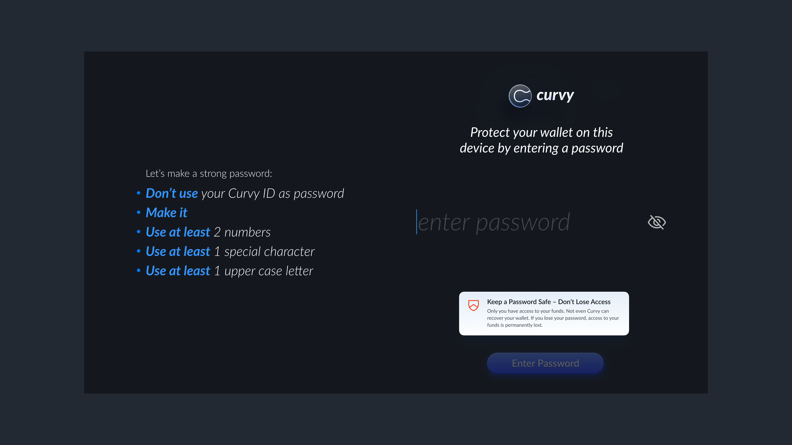

# Create Your Curvy Wallet

Curvy is a self-custody wallet. That means you control your account. If you lose access, nobody, not even Curvy, can recover it. 
So please read the following steps carefully and follow them to stay safe.

### Step 1: Connect a Wallet

To get started:

- Tap `Connect Wallet` on the Curvy web app.
  

- Select the wallet you’d like to use to create your Curvy account (e.g. Argent, MetaMask, Braavos).
  The wallet you connect becomes the key to your Curvy account. If you ever lose access to it, there’s no way to recover your funds. That’s why it’s important to pick a secure wallet from the start.

### Step 2: Sign the Setup Message

Once you connect your wallet, Curvy will ask you to sign a message.
This isn’t a transaction, it’s a local action that lets your wallet generate the keys needed to manage your Curvy account and stealth addresses. This happens entirely in your browser. Your private keys stay on your device and are never uploaded, shared, or stored anywhere else.

### Step 3: Set Up Your Curvy ID

Once your wallet is connected and keys are generated, you’ll set up your Curvy ID, a private, ENS-compatible username like `yourname.curvy.name`

Anyone can send funds to your Curvy ID privately. Each time it’s used, Curvy generates a brand-new stealth address ensuring there’s no link between one transaction and the next.

### Step 4: Create a Password

After choosing your Curvy ID, you’ll set a password to protect your wallet on this device. 
This ensures that even if someone gets access to your browser or device, they won’t be able to use your wallet without the password.

::: warning
Curvy never stores your password or private keys. If you lose your password, your funds can not be recovered and access is lost permanently.
:::
