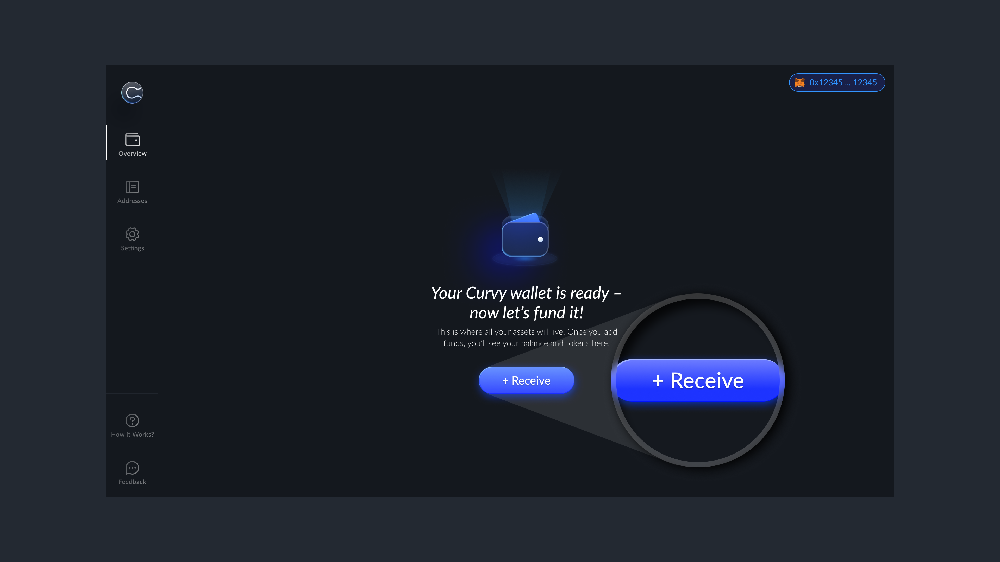
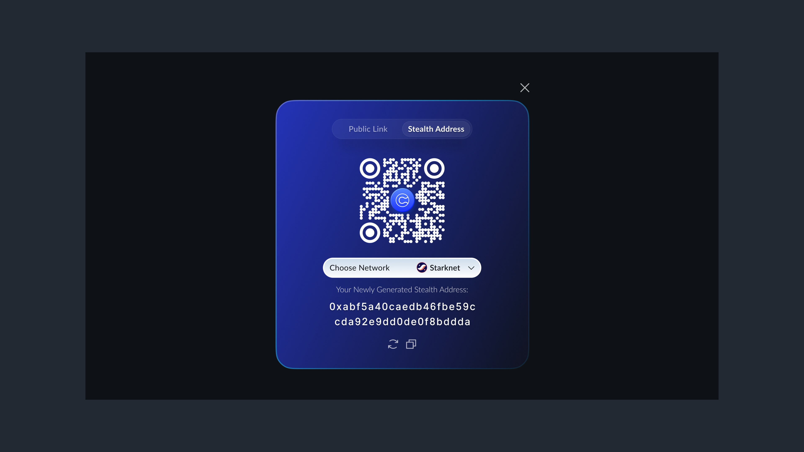
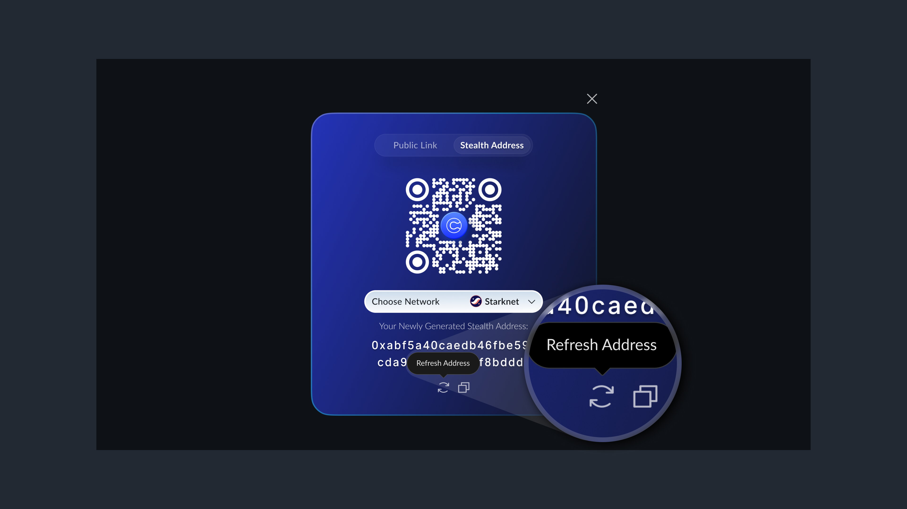

# Deposit Assets

There are 3 ways to receive assets into Curvy:

## Option 1: Share Your Curvy ID

- Share your Curvy ID with the sender (e.g. `yourname.curvy.name` )
- Anyone using a wallet that supports ENS off-chain resolvers can send funds to your Curvy ID privately.
When someone enters your Curvy ID in the recipient field, Curvy automatically generates a new stealth address in the background.

This allows you to receive private, unlinkable transactions through a familiar and shareable format supported across a wide range of ENS-compatible wallets. Every incoming payment goes to a new stealth address, keeping your transfers unlinkable and your identity protected.

## Option 2: Manually Generate a Stealth Address

- Tap `Receive` in the Curvy app

  
- A new stealth address will be generated automatically

  
- Tap the refresh icon if you want to generate another one

This method is useful when the sender’s wallet doesn’t support ENS off-chain resolver or when you want to share a specific stealth address directly.

## Option 3: Use Your Public Curvy Page
Your Curvy ID also acts as a personalised public page that you can share with others.
This page gives senders multiple options to transfer funds to your Curvy account. Whether via MetaMask, Argent, WalletConnect-compatible wallets, QR code, or by directly copying a freshly generated stealth address.

::: info
- **Curvy supports a wide range of blockchains.**
Check the latest list [here](./wallets-and-networks.html#supported-networks).
Make sure to select the correct network before sharing your stealth address. Addresses on different networks may differ in format. 
Sending funds to the wrong address may result in permanently losing them.

- **Curvy addresses are one-time use.**
Unlike traditional wallets, Curvy stealth addresses are designed for single use.
Reusing them reduces your privacy and can compromise the unlinkability of your transactions.
Read more [here](./best-practices-for-maximum-pivacy.html) about best practices for staying fully private when using Curvy.
:::
