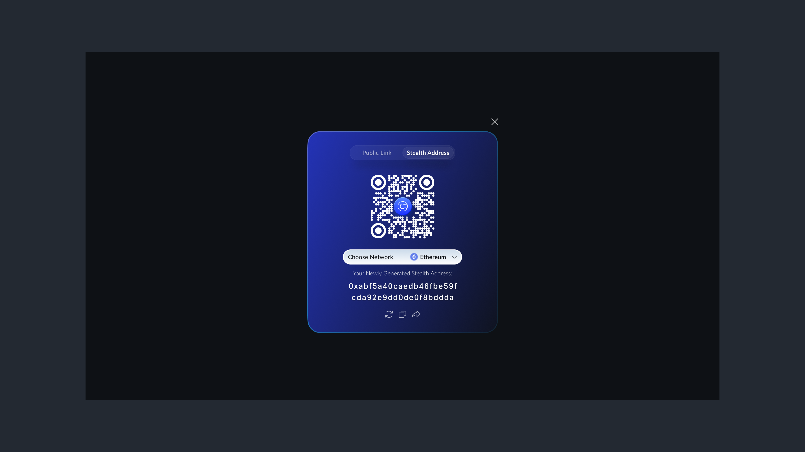

# ETH Belgrade – Participant Guide

## Step 1: Set Up Your Curvy Wallet

1. **Go to the Curvy Web App**

Navigate to [https://app.curvy.box](https://app.curvy.box/). This is where you'll set up your Curvy Wallet and manage your ETH deposit.

2. **Connect Your Wallet**

Tap `Connect Wallet`, then choose the wallet you'd like to use (e.g. MetaMask, Argent, Braavos).
The wallet you connect becomes the key to your Curvy account. Combined with the password you’ll set up in the next steps, it gives you the most secure way to access and manage your Curvy wallet.

    
3. **Sign to Generate Your Keys**
You'll be asked to sign a message (not a transaction). This action generates the keys needed to manage your Curvy account and stealth addresses, all locally in your browser. 
Note: Your private keys are never uploaded or shared.

4. **Create Your Curvy ID**
Choose your personalised, ENS-compatible username (e.g. `yourname.curvy.name`).

6. **Set a Password**
Create a strong password to secure access to your wallet on this device. This protects your wallet even if someone gains access to your browser.

## Step 2: Deposit ETH Into Your Curvy Wallet

Tap Receive in the Curvy Wallet.

You have 2 options:

- **Option 1 - Use Curvy ID:**
    
    If your sending wallet supports ENS off-chain resolvers, you can simply receive funds by entering your Curvy ID in the recipient field.
    
    > If you're not sure whether your wallet supports ENS off-chain resolvers, simply try entering your Curvy ID in the recipient field.
    > If the wallet automatically resolves it into a valid Ethereum address, that means it's supported and you can use your Curvy ID to send funds.
    
- **Option 2 - Use a Stealth Address:**
    
    Tap `Receive` app and copy your newly generated Ethereum stealth address and send funds to it just like any other address.
  
    

    ::: tip
    Make sure to deposit at least **0.05 ETH**, plus a bit extra to **cover transaction fees (gas)**.
    This ETH will be used as your commitment guarantee for the ETH Belgrade hackathon.
    :::

## Step 3: Send ETH to ETH Belgrade

1. Tap `Send` in the Curvy Wallet.

  
2. In the Recipient field, enter: `ethbelgrade.curvy.name`

3. Tap `Add Message` and include: Your name (same as the one used during hackathon registration)

   ::: warning
   Don’t skip this step - this is the only way ETH Belgrade organisers can identify that the deposit came from you.
   :::
   
4. Select **Network**: `Ethereum`
   
7. Choose the **Address**: Pick the address you previously deposited funds to.
   
9. Enter **Amount**: `0.05 ETH`
    
11. Review all details, then `Confirm` the transaction.

> Your transaction will be sent to a new stealth address generated for ETH Belgrade.
> The attached message will be **encrypted** and visible **only** to the ETH Belgrade organisers.

## Step 4: Receive Your Refund (After the Event)

If you attend the event, ETH Belgrade will return your ETH directly to your Curvy Wallet after the hackathon ends.
