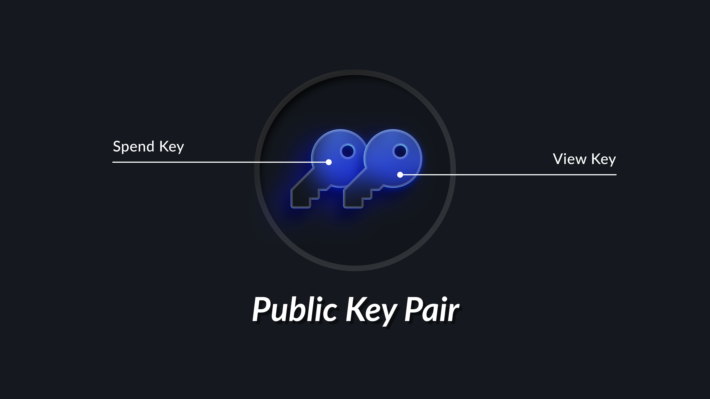

# How Privacy Works in Curvy

Curvy gives you privacy by default. When you receive crypto, a stealth address is automatically generated. When you send, you choose which stealth address to send from. That makes it nearly impossible to track your activity on-chain, as long as you follow best practices.

Here’s how it works, step by step. 

## Why Stealth Addresses?

On public blockchains, transactions are public and permanently visible. That means anyone can:

- Track how much crypto you hold
- Analyse your activity
- Link multiple transfers to the same identity

Curvy solves this by using stealth addresses, one-time-use addresses that are unique for each transaction. This makes your activity private and difficult to trace.

It’s like creating a new wallet for every transaction. The transactions are publicly visible, but it’s nearly impossible to know that all those wallets belong to you. However, managing multiple wallets manually would normally be difficult, time-consuming, and prone to mistakes.

Curvy simplifies all of that by generating a fresh stealth address behind the scenes for every transaction, keeping your activity unlinkable, without you ever needing to manage separate wallets yourself.

## What’s Happening Behind the Scenes

When you create your Curvy wallet, it generates 2 key pairs for you:

- A spend key that allows you to move and manage your funds
- A view key that allows your wallet to detect transactions meant for you

Your public keys are shared so others can send you funds. Your private keys stay with you - always.

### How You Receive Funds Privately

There are 2 main ways to receive crypto with Curvy:

1. Share your Curvy ID, and Curvy will automatically compute a stealth address for the sender to use
2. Manually generate a stealth address in the Curvy app and share it with the sender
 
In both cases:

- The stealth address is unique to that transaction  
- Only you and the sender know this address exists  
- Only you, the recipient, can detect and spend the funds

### Fast Transaction Detection

Curvy uses a lightweight view tag to scan for incoming transactions. This means your wallet doesn’t need to scan the entire blockchain, it only checks for relevant matches, making detection fast and efficient. This also makes private transfers fast and scalable.

### What’s Happening Under the Hood

Here’s how this actually works behind the scenes:

- The sender uses your public view key to calculate a shared secret  
- That shared secret is used to generate a new stealth address  
- You use your private view key to detect the transaction by matching the view tag  
- You use your private spend key to unlock and access the funds

Even though the stealth address is visible on-chain, only you can recognize and spend from it. Observers can’t connect it to your Curvy ID or wallet, unless you reuse addresses or leak patterns through your behavior.

If you’re curious about the technical deep dive, check out the full protocol breakdown

## What Makes This Special?

Curvy makes privacy simple, efficient, and user-controlled:

- **Unlinkable Transfers**  
  Each transaction uses a fresh stealth address, so no one can link your payments or trace your history.

- **No Extra Complexity**  
  You just share your Curvy ID or generate a stealth address with one click. Curvy handles the rest behind the scenes.

- **Lightweight Design**  
  No full-chain scanning required. Curvy uses lightweight view tags so your wallet can detect incoming transactions quickly and efficiently.

- **Multichain by Default**  
  Works on Ethereum and Starknet, and other EVM-compatible chains are coming soon.

- **Optional Transparency**  
  You can share your view key with an auditor to prove incoming transactions, without giving them spending access.
