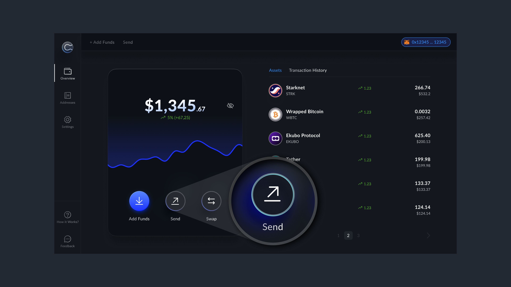

# Send Assets Privately

To send funds privately:

- Tap `Send`

- Enter the recipient’s Curvy ID or a regular wallet address
 

- Choose the stealth address you want to send from

- Select token and amount
 

- Click `Confirm & Send`

::: info
Currently, Curvy supports 1:1 private transfers only, which is why you need to choose a specific stealth address to send from.
Additionally, gasless transactions are not yet enabled, so sending from a stealth address requires at least a small amount of the native token to cover gas fees.

However, we are actively working on supporting gasless transactions and private batch transfers. In the future, Curvy will automatically combine assets from multiple stealth addresses and handle everything under the hood while still preserving full privacy.
:::
